# Program Hill Cipher (Enkripsi, Dekripsi, & Pencarian Kunci)

Program ini adalah implementasi **Hill Cipher** dalam bahasa Python untuk mengenkripsi,
mendekripsi, dan mencari kunci enkripsi, dengan dukungan **ukuran matriks kunci bebas (n x n)**,
bukan hanya 2x2. Semua operasi dilakukan dalam alfabet A–Z (26 huruf) sehingga seluruh
perhitungan matriks berada dalam **modulo 26**.

---

## 1. Alur Program (Overview)

```
                     ┌─────────────────────────┐
                     │ run_hill_cipher_program │   <-- fungsi utama (main loop)
                     └────────────┬────────────┘
                                  │
                 ┌────────────────┴────────────────┐
                 │       display_menu()            │  tampilkan menu 1-4
                 │       input_menu_choice()       │  ambil & validasi pilihan
                 └────────────────┬────────────────┘
                                  │
        ┌─────────────────────────┼─────────────────────────┐
        │                         │                         │
        ▼                         ▼                         ▼
  Mode 1: Enkripsi         Mode 2: Dekripsi          Mode 3: Cari Kunci
        │                         │                         │
        ▼                         ▼                         ▼
 get_all_inputs('1')      get_all_inputs('2')        get_all_inputs('3')
        │                         │                         │
        ▼                         ▼                         ▼
 process_all('1', data)   process_all('2', data)     process_all('3', data)
        │                         │                         │
        ▼                         ▼                         ▼
   show_output('1', ...)   show_output('2', ...)      show_output('3', ...)
                                  │
                                  ▼
                 input_yes_no("mau operasi lain?")
                     ya -> kembali ke menu
                     tidak -> program selesai
```

Program berbasis **menu interaktif via terminal** yang terus berulang (loop) sampai
user memilih **"4. Keluar dari program"** atau menjawab **"tidak"** saat ditanya
apakah ingin melakukan operasi lain.

### Struktur Modular

Sesuai prinsip modular, fungsi-fungsi dikelompokkan menjadi 3 kategori besar,
masing-masing memiliki satu **fungsi pengatur** yang memanggil fungsi-fungsi
kecil di dalamnya:

1. **INPUT** → semua fungsi `input_*()` dipanggil oleh satu fungsi pengatur:
   **`get_all_inputs(mode)`**
2. **PROSES** → semua fungsi `process_*()` dipanggil oleh satu fungsi pengatur:
   **`process_all(mode, data)`**
3. **OUTPUT** → semua fungsi `display_*()` dipanggil oleh satu fungsi pengatur:
   **`show_output(mode, result_data)`**

Fungsi matematika inti (determinan, invers matriks mod, perkalian matriks, dll)
dipisah tersendiri karena sifatnya murni komputasi dan dipakai bersama oleh
semua mode (encrypt/decrypt/cari kunci)

---

## 2. Penjelasan Tiap Menu

### Menu 1 — Enkripsi
1. User memasukkan ukuran matriks kunci `n`.
2. User memasukkan elemen matriks kunci `n x n` (divalidasi harus invertible mod 26).
3. User memasukkan plaintext yang ingin dienkripsi.
4. Plaintext dibersihkan (hanya huruf A-Z) lalu **di-padding otomatis** dengan huruf
   `X` di akhir jika panjangnya belum kelipatan `n`.
5. Plaintext diubah ke angka (A=0 ... Z=25), dikelompokkan per blok berukuran `n`,
   lalu setiap blok dikalikan dengan matriks kunci (mod 26): `C = K × P (mod 26)`.
6. Hasil angka diubah kembali menjadi huruf → **ciphertext**.

### Menu 2 — Dekripsi
1. User memasukkan ukuran matriks kunci `n`.
2. User memasukkan elemen matriks kunci (divalidasi harus invertible mod 26).
3. User memasukkan ciphertext (panjangnya **wajib** kelipatan `n`, **tidak** di-padding
   otomatis karena padding pada ciphertext akan merusak hasil dekripsi).
4. Program menghitung invers matriks kunci mod 26: `K⁻¹ = det(K)⁻¹ × adj(K) (mod 26)`.
5. Ciphertext diubah ke angka, dikelompokkan per blok, dikalikan dengan `K⁻¹`
   (mod 26): `P = K⁻¹ × C (mod 26)`.
6. Hasil angka diubah kembali menjadi huruf → **plaintext**.

### Menu 3 — Cari Kunci Hill Cipher
Tersedia dua metode:

- **Known-Plaintext Attack**: berdasarkan pasangan plaintext & ciphertext yang
  sudah diketahui. Membutuhkan minimal `n × n` huruf plaintext beserta pasangan
  ciphertext-nya. Kunci dihitung dengan rumus `K = C × P⁻¹ (mod 26)`, di mana
  `P` adalah matriks blok plaintext (kolom = blok) dan `C` adalah matriks blok
  ciphertext yang bersesuaian. Metode ini **cepat** (langsung dihitung secara
  aljabar) namun mensyaratkan blok plaintext yang dipilih harus invertible mod 26
  (blok-bloknya harus saling independen).

- **Brute Force**: mencoba **semua kemungkinan** matriks kunci `n x n` dengan
  elemen 0–25, lalu memverifikasi apakah hasil enkripsi setiap kandidat kunci
  cocok dengan pasangan plaintext-ciphertext yang diberikan. Karena jumlah
  kombinasi adalah `26^(n×n)`, metode ini **hanya diaktifkan untuk ukuran
  maksimal 2×2** (`26^4 = 456.976` kombinasi, masih realistis). Untuk ukuran
  lebih besar, program otomatis menolak dan meminta user memakai metode
  known-plaintext saja, karena brute force di atas 2×2 sudah mustahil dihitung
  dalam waktu wajar (misalnya untuk 3×3 dibutuhkan `26^9 ≈ 5,4 × 10¹²` percobaan).

---

## 3. Pendekatan Matematis & Efisiensi

- **Determinan & Adjugate**: dihitung dengan ekspansi kofaktor rekursif murni
  integer (tanpa floating point) agar hasil selalu tepat/akurat dan tidak ada
  galat pembulatan — penting karena semua perhitungan berbasis aritmetika modulo.
- **Invers matriks mod 26**: menggunakan rumus `K⁻¹ = det(K)⁻¹ × adj(K) (mod 26)`,
  dengan `det(K)⁻¹` dicari melalui **Extended Euclidean Algorithm** (efisien,
  O(log m)), bukan brute force.
- **Perkalian matriks**: hasil setiap perkalian langsung di-`mod 26` di setiap
  langkah, sehingga angka yang disimpan selalu kecil (0–25) → hemat memori dan
  komputasi tetap cepat meski teks yang dienkripsi/didekripsi panjang.
- **Pemrosesan per blok**: teks diproses per blok kecil (list angka), tidak
  membangun struktur data besar yang tidak perlu.
- **Batas ukuran matriks** (`MAX_MATRIX_SIZE = 8`) mencegah user memasukkan
  ukuran yang akan membuat komputasi determinan/adjugate (kompleksitas
  eksponensial terhadap `n` karena ekspansi kofaktor) menjadi sangat lambat
  atau boros memori.
- **Batas brute force** (`BRUTEFORCE_MAX_N = 2`) mencegah program "menggantung"
  mencoba triliunan kombinasi yang tidak mungkin selesai.

---

## 4. Daftar Error Handling

### a. Validasi Menu & Pilihan
| Situasi | Pesan / Perilaku |
|---|---|
| Pilihan menu bukan 1-4 | `[ERROR] Pilihan tidak dikenali! Harap masukkan angka 1, 2, 3, atau 4 sesuai menu di atas.` → user diminta memilih ulang |
| Pilihan metode cari kunci bukan 1-2 | `[ERROR] Pilihan tidak dikenali! Harap masukkan angka 1 atau 2.` → diminta memilih ulang |
| Jawaban y/n tidak dikenali | `[ERROR] Jawaban tidak dikenali! Harap masukkan 'y' untuk ya atau 'n' untuk tidak.` → diminta menjawab ulang |

### b. Validasi Ukuran Matriks
| Situasi | Pesan / Perilaku |
|---|---|
| Input bukan angka bulat | `[ERROR] Ukuran matriks harus berupa angka bulat! Silakan masukkan ulang.` |
| Ukuran < 1 | `[ERROR] Ukuran matriks minimal adalah 1! Silakan masukkan ulang.` |
| Ukuran > 8 (MAX_MATRIX_SIZE) | `[ERROR] Ukuran matriks terlalu besar (maksimal 8x8) karena akan sangat lambat dan boros memori untuk dihitung! Silakan masukkan ukuran yang lebih kecil.` |
| Ukuran > 5 (tapi masih ≤ 8) | `[PERINGATAN] Ukuran matriks NxN cukup besar sehingga proses perhitungan determinan/invers bisa memakan waktu lebih lama dari biasanya.` (tetap dilanjutkan) |

### c. Validasi Matriks Kunci
| Situasi | Pesan / Perilaku |
|---|---|
| Jumlah elemen pada satu baris ≠ n | `[ERROR] Jumlah angka pada baris ini harus tepat N buah! Silakan masukkan ulang baris ini.` |
| Elemen bukan bilangan bulat | `[ERROR] Semua elemen matriks harus berupa angka bulat! Silakan masukkan ulang baris ini.` |
| Matriks tidak invertible mod 26 (`gcd(det,26) != 1`) | `[ERROR] Matriks kunci tersebut TIDAK VALID untuk Hill Cipher karena determinannya tidak memiliki invers modulo 26 (gcd(determinan, 26) harus = 1). Silakan masukkan matriks kunci yang lain.` → seluruh matriks diminta diinput ulang |

### d. Validasi Teks (Plaintext/Ciphertext)
| Situasi | Pesan / Perilaku |
|---|---|
| Input kosong | `[ERROR] ... tidak boleh kosong! Silakan masukkan kembali.` |
| Input tidak mengandung huruf A-Z sama sekali (misal hanya angka/simbol) | `[ERROR] ... harus mengandung minimal satu huruf (A-Z)! Karakter selain huruf akan diabaikan. Silakan masukkan kembali.` |
| Input mengandung karakter selain huruf (spasi, angka, tanda baca) namun masih ada huruf | Karakter tersebut **otomatis dibuang**, lalu ditampilkan info: `[INFO] Karakter non-huruf pada input telah diabaikan. Teks yang diproses: ...` (tetap dilanjutkan, bukan error) |
| Panjang teks kurang dari kebutuhan minimal (khusus fitur cari kunci, butuh ≥ n×n huruf) | `[ERROR] ... terlalu pendek! Dibutuhkan minimal N huruf. Silakan masukkan kembali.` |

### e. Validasi Khusus Dekripsi
| Situasi | Pesan / Perilaku |
|---|---|
| Panjang ciphertext bukan kelipatan `n` | `[ERROR] Panjang ciphertext (X huruf) harus merupakan kelipatan dari ukuran matriks kunci (N)! Ciphertext hasil enkripsi Hill Cipher yang valid pasti sudah berupa kelipatan N. Silakan periksa kembali teks cipher Anda.` (ciphertext **tidak** di-padding otomatis, karena akan mengubah makna hasil dekripsi) |

### f. Validasi Khusus Pencarian Kunci
| Situasi | Pesan / Perilaku |
|---|---|
| Panjang plaintext & ciphertext yang diketahui tidak sama | `[ERROR] Panjang plaintext dan ciphertext yang diketahui harus SAMA (saling berpasangan huruf per huruf)! Silakan masukkan ulang keduanya.` |
| Data kurang dari `n × n` huruf | `[ERROR] Untuk mencari kunci berukuran NxN, dibutuhkan minimal N×N huruf plaintext beserta pasangan ciphertext-nya! Silakan masukkan ulang dengan teks yang lebih panjang.` |
| Metode brute force dipilih untuk ukuran matriks > 2×2 | `[PERINGATAN] Metode Brute Force untuk matriks NxN harus mencoba hingga 26^(N×N) (~... ) kemungkinan kunci, yang TIDAK REALISTIS untuk dihitung dalam waktu wajar! Brute force hanya didukung untuk ukuran maksimal 2x2. Silakan pilih metode Known-Plaintext Attack, atau gunakan ukuran matriks yang lebih kecil.` → user diminta memilih metode lain |
| Blok plaintext yang dipilih (known-plaintext) tidak invertible mod 26, sehingga kunci gagal ditemukan | `[ERROR] Kunci Hill Cipher TIDAK ditemukan dari data plaintext/ciphertext yang diberikan. Kemungkinan penyebab: data pasangan plaintext-ciphertext tidak konsisten, atau blok plaintext yang dipakai tidak memiliki invers modulo 26. Silakan coba dengan pasangan data lain.` |
| Brute force tidak menemukan kunci yang cocok sama sekali | Pesan error yang sama seperti di atas |

### g. Penanganan Error Tak Terduga & Sistem
| Situasi | Pesan / Perilaku |
|---|---|
| Terjadi exception tak terduga saat proses komputasi (mode 1/2/3) | `[ERROR] Terjadi kesalahan tak terduga saat memproses data (...). Silakan periksa kembali input Anda dan coba lagi.` → program **tidak crash**, kembali ke menu |
| User menekan `Ctrl+C` di mana pun saat program berjalan | Program keluar dengan rapi: `Program dihentikan paksa oleh pengguna (Ctrl+C). Sampai jumpa!` (tanpa traceback error) |
| Error fatal tak terduga di luar semua penanganan di atas | `Terjadi kesalahan fatal pada program: ... Program akan ditutup.` (tanpa traceback error) |

---

## 5. Contoh Penggunaan Singkat

**Enkripsi** `MAGANG` dengan kunci `[[7,6],[2,5]]` menghasilkan ciphertext **`GYQMXE`**.

**Dekripsi** `GYQMXE` dengan kunci yang sama akan mengembalikan **`MAGANG`**.

**Cari kunci** dari pasangan plaintext `HELP` & ciphertext `VILT` (metode known-plaintext
maupun brute force) akan menemukan kembali kunci **`[[7,6],[2,5]]`**.

---

## 6. Batasan Program

- Hanya mendukung alfabet A–Z (26 huruf); karakter lain otomatis dibuang dari input.
- Ukuran matriks kunci dibatasi maksimal 8×8 demi menjaga performa & penggunaan memori.
- Metode brute force pencarian kunci hanya didukung untuk matriks maksimal 2×2,
  karena kompleksitas waktu yang eksponensial (`26^(n×n)`) untuk ukuran yang lebih besar.


Screenshoot running program:
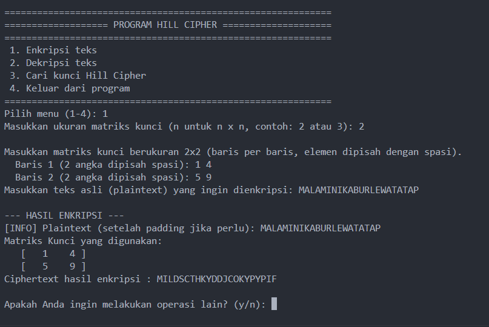
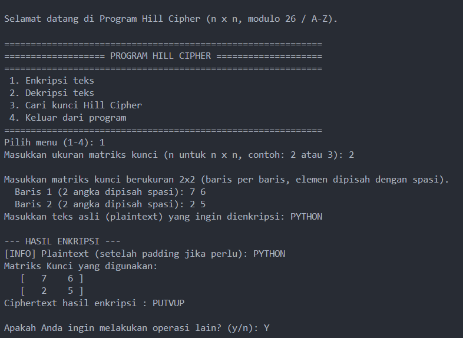
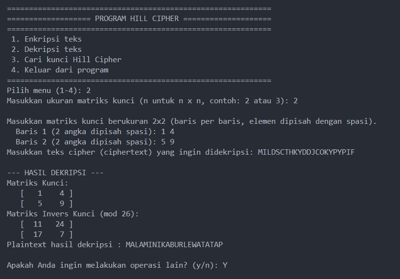
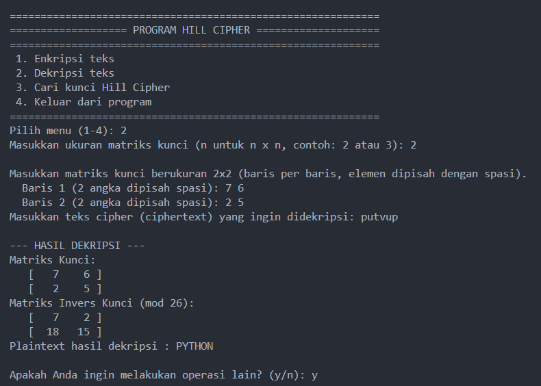
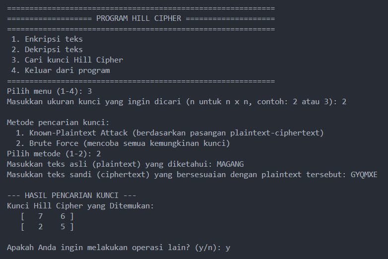
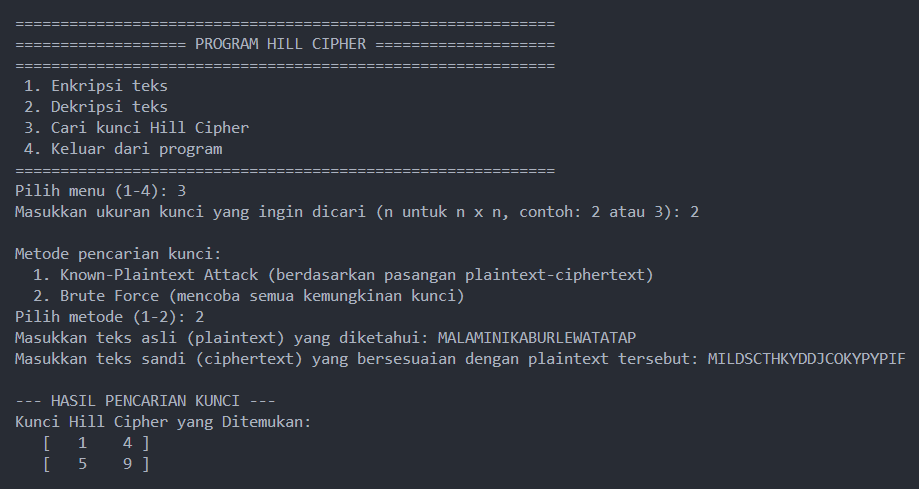
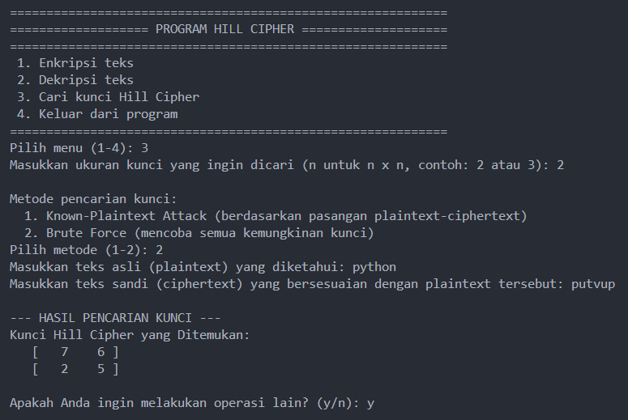
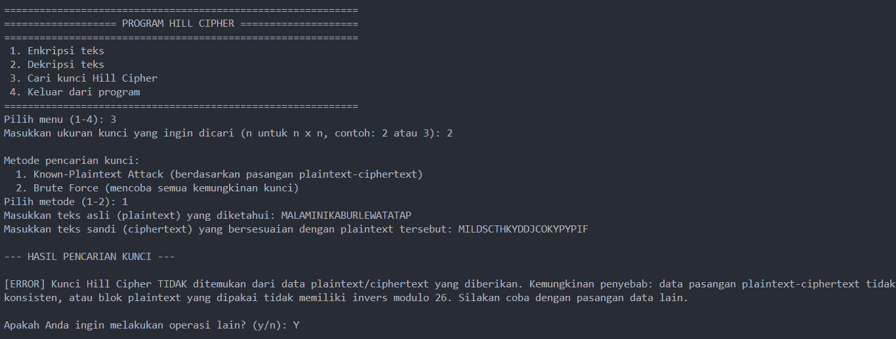
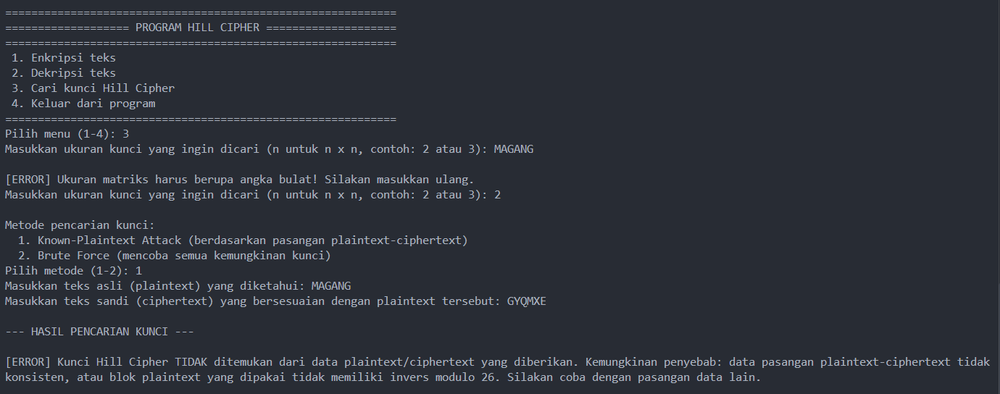
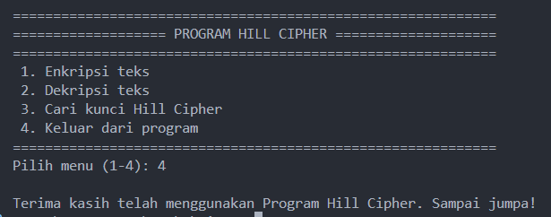

Contoh Error Handling:
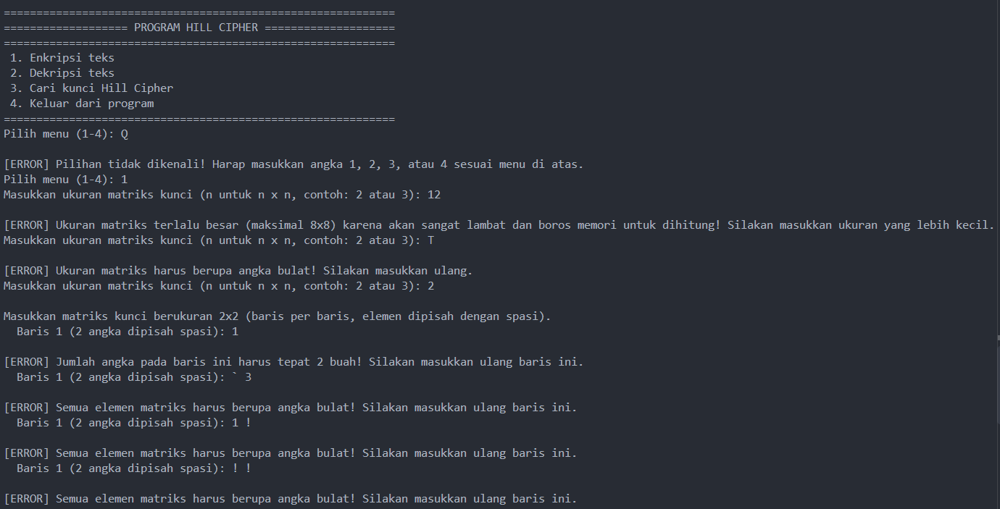