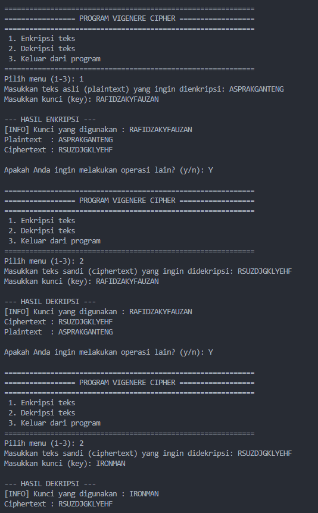

# Program Vigenere Cipher

Program ini adalah implementasi **Vigenere Cipher** dengan **kunci berulang** dalam bahasa Python untuk mengenkripsi dan mendekripsi teks.
Semua operasi pergeseran huruf dilakukan dalam alfabet A–Z (26 huruf) sehingga
seluruh perhitungan berada dalam **modulo 26**.

---

## 1. Alur Program (Overview)

```
                     ┌──────────────────────┐
                     │ run_vigenere_program │   <-- fungsi utama (main loop)
                     └───────────┬──────────┘
                                 │
                ┌────────────────┴────────────────┐
                │        display_menu()           │  tampilkan menu 1-3
                │        input_menu_choice()      │  ambil & validasi pilihan
                └────────────────┬────────────────┘
                                 │
                 ┌────────────────┼────────────────┐
                 │                                 │
                 ▼                                 ▼
          Mode 1: Enkripsi                 Mode 2: Dekripsi
                 │                                 │
                 ▼                                 ▼
       get_all_inputs('1')               get_all_inputs('2')
                 │                                 │
                 ▼                                 ▼
       process_all('1', data)            process_all('2', data)
                 │                                 │
                 ▼                                 ▼
        show_output('1', ...)             show_output('2', ...)
                                 │
                                 ▼
                input_yes_no("mau operasi lain?")
                    ya -> kembali ke menu
                    tidak -> program selesai
```

### Struktur Modular

Fungsi-fungsi dikelompokkan menjadi 3 kategori besar, masing-masing memiliki satu
**fungsi "pengatur" (all-in-one)** yang memanggil fungsi-fungsi kecil di dalamnya:

1. **INPUT** → semua fungsi `input_*()` dipanggil oleh satu fungsi pemersatu:
   **`get_all_inputs(mode)`**
2. **PROSES** → semua fungsi `process_*()` dipanggil oleh satu fungsi pemersatu:
   **`process_all(mode, data)`**
3. **OUTPUT** → semua fungsi `display_*()` dipanggil oleh satu fungsi pemersatu:
   **`show_output(mode, result_data)`**

Fungsi inti algoritma (`vigenere_transform`) serta fungsi utilitas teks
(`only_letters`, `clean_key`, `count_letters`) dipisah tersendiri.

---

## 2. Penjelasan Tiap Menu

### Menu 1 — Enkripsi
1. User memasukkan plaintext yang ingin dienkripsi (boleh mengandung huruf besar/kecil,
   spasi, angka, dan tanda baca).
2. User memasukkan kunci (key); karakter non-huruf pada kunci otomatis dibuang.
3. Setiap karakter **huruf** pada plaintext digeser sebanyak nilai huruf kunci yang
   bersesuaian (berulang secara siklis): `C = (P + K) mod 26`.
4. Karakter **non-huruf** disalin apa adanya ke posisi yang sama pada ciphertext,
   tanpa menggeser posisi kunci.
5. Case (huruf besar/kecil) tiap huruf plaintext dipertahankan pada ciphertext.

### Menu 2 — Dekripsi
1. User memasukkan ciphertext yang ingin didekripsi.
2. User memasukkan kunci (key) yang sama dengan yang dipakai saat enkripsi.
3. Setiap karakter **huruf** pada ciphertext dikembalikan dengan mengurangi nilai
   huruf kunci yang bersesuaian: `P = (C - K) mod 26`.
4. Karakter **non-huruf** disalin apa adanya, dan case huruf dipertahankan —
   sama seperti proses enkripsi namun kebalikan arah pergeserannya.

---

## 3. Daftar Error Handling

### a. Validasi Menu & Pilihan
| Situasi | Pesan / Perilaku |
|---|---|
| Pilihan menu bukan 1-3 | `[ERROR] Pilihan tidak dikenali! Harap masukkan angka 1, 2, atau 3 sesuai menu di atas.` → diminta memilih ulang |
| Jawaban y/n tidak dikenali | `[ERROR] Jawaban tidak dikenali! Harap masukkan 'y' untuk ya atau 'n' untuk tidak.` → diminta menjawab ulang |

### b. Validasi Teks (Plaintext/Ciphertext)
| Situasi | Pesan / Perilaku |
|---|---|
| Input kosong (Enter tanpa mengetik apa pun) | `[ERROR] ... tidak boleh kosong! Silakan masukkan kembali.` |
| Input tidak mengandung huruf sama sekali (misal hanya angka/simbol/spasi) | `[ERROR] ... harus mengandung minimal satu huruf (A-Z/a-z) agar dapat diproses! Silakan masukkan kembali.` |
| Input mengandung campuran huruf & non-huruf | **Diterima langsung** — karakter non-huruf otomatis dipertahankan apa adanya di hasil, tidak dianggap error |

### c. Validasi Kunci (Key)
| Situasi | Pesan / Perilaku |
|---|---|
| Kunci kosong | `[ERROR] Kunci tidak boleh kosong! Silakan masukkan kembali.` |
| Kunci tidak mengandung huruf sama sekali (misal hanya angka/simbol) | `[ERROR] Kunci harus mengandung minimal satu huruf (A-Z)! Karakter non-huruf tidak dapat dijadikan kunci. Silakan masukkan kembali.` |
| Kunci mengandung campuran huruf & non-huruf | Karakter non-huruf **otomatis dibuang** dari kunci, lalu ditampilkan info: `[INFO] Karakter non-huruf pada kunci telah diabaikan. Kunci yang digunakan: ...` (tetap dilanjutkan, bukan error) |

### d. Penanganan Error Tak Terduga & Sistem
| Situasi | Pesan / Perilaku |
|---|---|
| Terjadi exception tak terduga saat proses komputasi (mode 1/2) | `[ERROR] Terjadi kesalahan tak terduga saat memproses data (...). Silakan periksa kembali input Anda dan coba lagi.` → program **tidak crash**, kembali ke menu |
| User menekan `Ctrl+C` di mana pun saat program berjalan | Program keluar dengan rapi: `Program dihentikan paksa oleh pengguna (Ctrl+C). Sampai jumpa!` (tanpa traceback error) |
| Error fatal tak terduga di luar semua penanganan di atas | `Terjadi kesalahan fatal pada program: ... Program akan ditutup. Mohon laporkan masalah ini jika terus terjadi.` (last-resort catch, tetap tanpa traceback Python mentah) |

---

## 4. Contoh Penggunaan Singkat

**Enkripsi** `Hello, World! 123` dengan kunci `KUNCI` menghasilkan ciphertext
**`Ryynw, Gienl! 123`** — perhatikan spasi, koma, tanda seru, dan angka `123`
tetap berada di posisi yang sama, dan huruf `H` tetap menjadi huruf kapital `R`.

**Dekripsi** `Ryynw, Gienl! 123` dengan kunci `KUNCI` yang sama akan mengembalikan
teks asli **`Hello, World! 123`**.

---

## 5. Batasan Program

- Hanya huruf A-Z/a-z yang diproses secara kriptografis; karakter lain (spasi,
  angka, tanda baca, karakter Unicode non-Latin) hanya disalin apa adanya dan
  tidak memengaruhi maupun dipengaruhi oleh proses enkripsi/dekripsi.
- Kunci wajib mengandung minimal satu huruf; karakter non-huruf pada kunci akan
  dibuang otomatis dan tidak dihitung sebagai bagian dari kunci.

---

## 6. Screenshot Hasil Running Program

